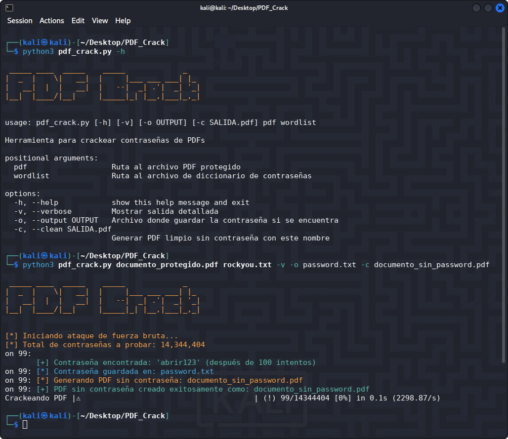

<h1 align="center">PDF Crack 🥷🏼</h1>

<p align="center">
  Herramienta sencilla para probar y recuperar contraseñas de archivos PDF mediante ataques basados en diccionarios <strong>Úsala únicamente con archivos de tu propiedad o cuando tengas permiso explícito</strong> (ver sección Legal / Ética).
</p>

<p align="center">
  
</p>

<p align="center">
  
  
</p>

---

## 🚀 Características

- Soporta ataque por diccionario.
- Opciones para salida verbosa, guardar contraseña encontrada y generar una copia del <strong>PDF sin contraseña</strong>.
- Interfaz de línea de comandos simple y compacta.
- Compatible con Python 3.

## 📌 Requisitos

- Python 3.8+

- Librerías: `PyPDF2`, `colorama`, `alive-progress`

## ⚠️ Legal / Ética

- <strong>Importante:</strong> Esta herramienta puede usarse para actividades maliciosas si se emplea sin autorización. Está pensada para auditoría personal, recuperación de contraseñas propias, y propósitos educativos. No uses esta herramienta para acceder a documentos ajenos sin permiso. El autor no se responsabiliza por el uso indebido.

🔴 **No utilices esta herramienta para actividades ilegales.**

🟢 **El autor no se hace responsable del mal uso que otros puedan darle.**

---
## ⚙️ Instalación

Clona el repositorio:

```bash
git clone https://github.com/HackUnderway/PDF_Crack.git
```
```bash
cd PDF_Crack
```
```bash
pip install -r requirements.txt
```

## Instala qpdf si quieres usar la opción -c (ejemplos para Debian/Ubuntu):

```bash
sudo apt update
```
```bash
sudo apt install qpdf
```

## 🐍 Uso básico 
##### Ejecuta el script:

Ejemplo seguro (usa tus propios archivos o archivos con permiso):

```bash
python3 pdf_crack.py documento_protegido.pdf rockyou.txt -v -o password.txt -c documento_sin_password.pdf
```

- Mensajes informativos durante el progreso.

- Archivo de salida (si se solicita) con la contraseña encontrada.

- PDF limpio sin contraseña si se solicita y la contraseña fue encontrada con éxito.


> **El proyecto está abierto a colaboradores.**

# DISTRIBUCIONES SOPORTADAS
|Distribución | Versión verificada | 	¿Soportado? | 	Estado |
|--------------|--------------------|------|-------|
|Kali Linux| 2025.3| si| funcionando   |
|Parrot Security OS| 6.3| si | funcionando   |
|Windows| 11 | si | funcionando   |
|BackBox| 9 | si | funcionando   |
|Arch Linux| 2024.12.01 | si | funcionando   |

# SOPORTE
Preguntas, errores o sugerencias: info@hackunderway.com

# LICENSE
- [x] PDF Crack tiene licencia.
- [x] Consulta el archivo [LICENSE](https://github.com/HackUnderway/PDF_Crack#MIT-1-ov-file) para más información.

# CYBERSECURITY RESEARCHER

* [Victor Bancayan](https://www.offsec.com/bug-bounty-program/) - (**CEO at [Hack Underway](https://hackunderway.com/)**) 

## 🔗 ENLACES
[](https://www.patreon.com/c/HackUnderway)
[](https://hackunderway.com)
[](https://www.facebook.com/HackUnderway)
[](https://www.youtube.com/@JeyZetaOficial)
[](https://x.com/JeyZetaOficial)
[](https://instagram.com/hackunderway)
[](https://tryhackme.com/p/JeyZeta)

## ☕️ Apoya el proyecto

Si te gusta esta herramienta, considera invitarme un café:

[](https://www.buymeacoffee.com/hackunderway)

## Tienda:
https://hackunderway.com/tienda/

## 🌞 Suscripciones

###### Suscríbete a: [Jey Zeta](https://www.facebook.com/JeyZetaOficial/subscribe/)

[](https://www.kali.org/)

from  made in  with  by: <font color="red">Victor Bancayan</font>

© 2025