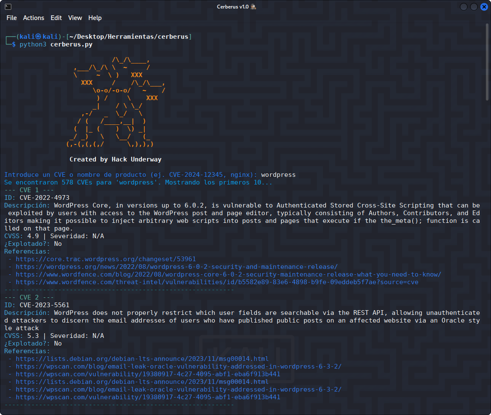
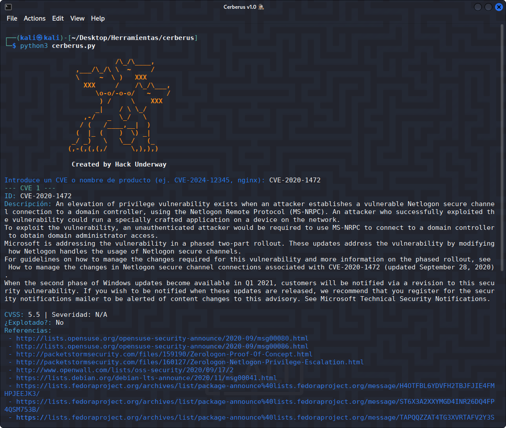

<h1 align="center">CERBERUS 👁</h1>

<p align="center">
  Herramienta de extracción de exploits desde <strong>Shodan Exploits</strong> para facilitar la búsqueda de vulnerabilidades conocidas.
</p>

<p align="center">
  
</p>

<p align="center">
  
  
  
</p>

---

## 🚀 Características

- Búsqueda de exploits por palabra clave (ej. CVE-2024-XXXX, Laravel, WordPress, etc.).
- Extracción de resultados desde <strong>Shodan Exploits</strong>.
- Visualización clara con título, enlace, autor, etiquetas y contenido.
- Compatible con Python 3.

## 📌 Requisitos

- Python 3.8+

- Librerías: `requests`, `colorama`

## ⚠️ Advertencia de uso

- Esta herramienta ha sido creada únicamente con fines educativos y de investigación en seguridad.
- El uso indebido para actividades maliciosas es responsabilidad del usuario.

🔴 **No utilices esta herramienta para actividades ilegales.**

🟢 **El autor no se hace responsable del mal uso que otros puedan darle.**

---
## ⚙️ Instalación

Clona el repositorio:

```bash
git clone https://github.com/HackUnderway/cerberus.git
```
```bash
cd cerberus
```
```bash
pip install -r requirements.txt
```

## 🐍 Uso básico 
##### Ejecuta el script:

python3 cerberus.py

- Se te pedirá un término de búsqueda. Ejemplo:

- CVE-2024-24919

- Laravel

<p align="center">
  
</p>

> **El proyecto está abierto a colaboradores.**


# DISTRIBUCIONES SOPORTADAS
|Distribución | Versión verificada | 	¿Soportado? | 	Estado |
|--------------|--------------------|------|-------|
|Kali Linux| 2025.2| si| funcionando   |
|Parrot Security OS| 6.3| si | funcionando   |
|Windows| 11 | si | funcionando   |
|BackBox| 9 | si | funcionando   |
|Arch Linux| 2024.12.01 | si | funcionando   |

# SOPORTE
Preguntas, errores o sugerencias: info@hackunderway.com

# LICENSE
- [x] Cerberus tiene licencia.
- [x] Consulta el archivo [LICENSE](https://github.com/HackUnderway/cerberus#MIT-1-ov-file) para más información.

# CYBERSECURITY RESEARCHER

* [Victor Bancayan](https://www.offsec.com/bug-bounty-program/) - (**CEO at [Hack Underway](https://hackunderway.com/)**) 

## 🔗 ENLACES
[](https://www.patreon.com/c/HackUnderway)
[](https://hackunderway.com)
[](https://www.facebook.com/HackUnderway)
[](https://www.youtube.com/@JeyZetaOficial)
[](https://x.com/JeyZetaOficial)
[](https://instagram.com/hackunderway)
[](https://tryhackme.com/p/JeyZeta)

## ☕️ Apoya el proyecto

Si te gusta esta herramienta, considera invitarme un café:

[](https://www.buymeacoffee.com/hackunderway)

## Manual Shodan para Pentesters:
https://hackunderway.com/producto/shodan-para-pentesters/

## 🌞 Suscripciones

###### Suscríbete a: [Jey Zeta](https://www.facebook.com/JeyZetaOficial/subscribe/)

[](https://www.kali.org/)

from  made in  with  by: <font color="red">Victor Bancayan</font>

© 2025
