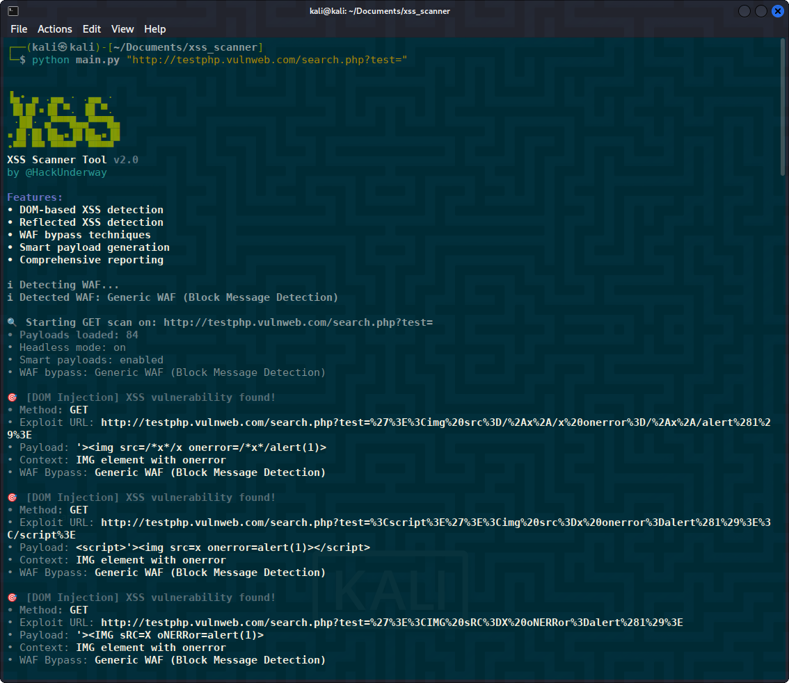
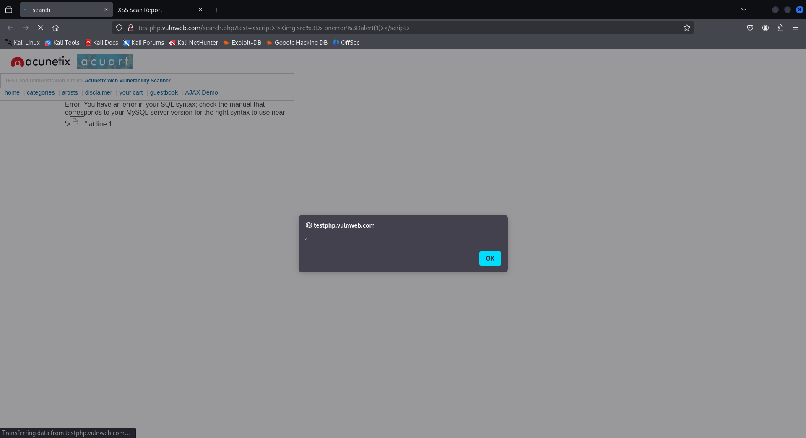
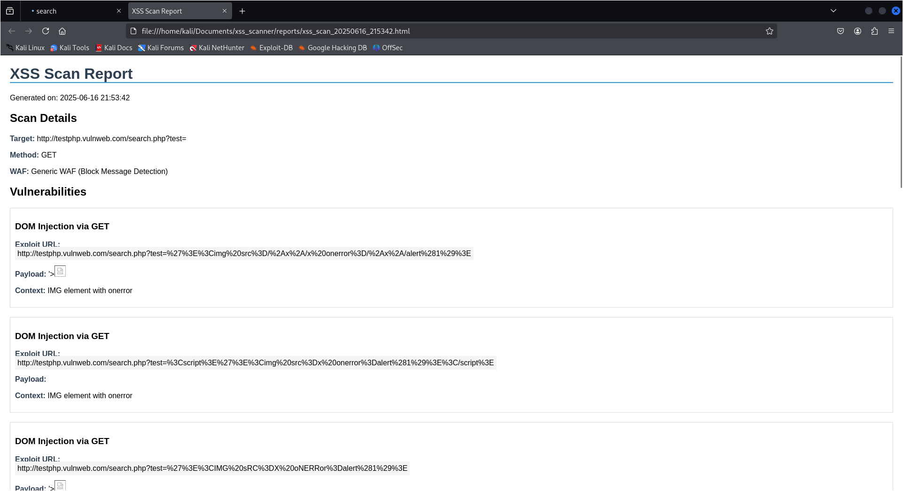
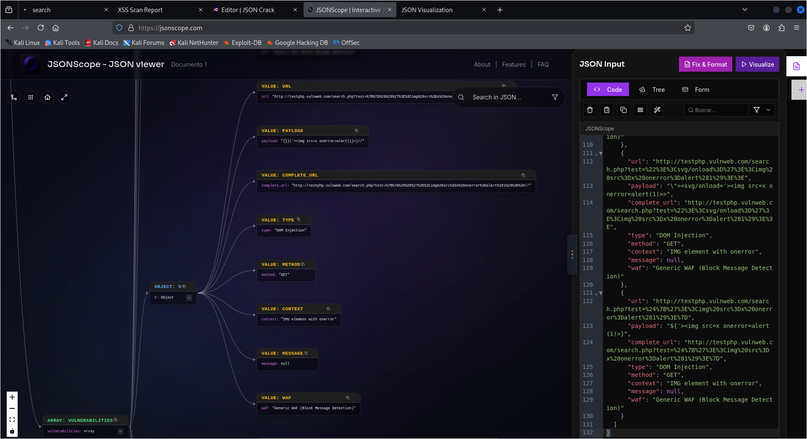
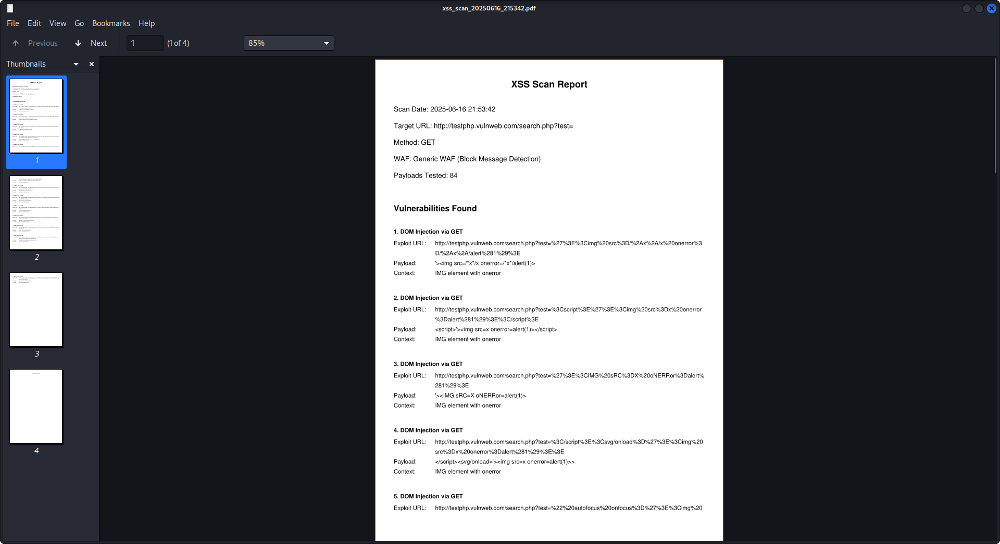

<h1 align="center">XSS Scanner Tool 🕵🏽‍♂️</h1>

<p align="center">
  Herramienta avanzada de escaneo XSS (Cross-Site Scripting) para auditorías de seguridad web, con capacidades de evasión de WAF y generación de reportes completos.
</p>

<p align="center">
  
  
  
</p>

---

## 🔍 Características principales

- **Detección multifacética**:
  - XSS reflejado y basado en DOM
  - Context-aware payloads (identifica el contexto de inyección)
  - Técnicas avanzadas de evasión de WAFs (Cloudflare, Cloudfront, etc.)

- **Motor inteligente**:
  - Generación dinámica de payloads
  - Detección automática de WAFs
  - Modo headless con Puppeteer/Playwright

- **Reporting profesional**:
  - Reportes en HTML, PDF y JSON
  - Explicación detallada de vulnerabilidades
  - URLs de explotación listas para pruebas.

## 🚀 Casos de uso típicos

1. **Auditorías de seguridad**
```bash
python main.py "https://example.com/search?q=" -w cloudflare
```
2. **Pruebas de penetración**
```bash
python main.py "https://testphp.vulnweb.com/artists.php?artist=" -v
```
3. **Investigación de WAFs:**
```bash
python main.py "https://testphp.vulnweb.com/artists.php?artist=" -v
```

## 📌 Requisitos técnicos

- Python 3.11+

- Navegador Chromium/Chrome instalado

- Dependencias: playwright, argparse, pyfiglet

## ⚠️ Consideraciones éticas

#### Esta herramienta debe usarse únicamente en:

- Sitios propios con permiso explícito

- Entornos de pruebas controlados

- Programas de bug bounty con autorización

- El uso no autorizado en sistemas ajenos es ilegal.

---
## ⚙️ Instalación

Clona el repositorio:

```bash
git clone https://github.com/HackUnderway/xss_scanner.git
```
```bash
cd xss_scanner
```
```bash
pip install -r requirements.txt
```

#### Instalar navegadores (Chromium)
```bash
playwright install chromium
```
#### Verificar instalación
```bash
python -c "from playwright.sync_api import sync_playwright; sync_playwright().start()"
```
#### Ayuda/Guía
```bash
python main.py -h
```
```bash
▐▄• ▄ .▄▄ · .▄▄ · 
 █▌█▌▪▐█ ▀. ▐█ ▀. 
 ·██· ▄▀▀▀█▄▄▀▀▀█▄
▪▐█·█▌▐█▄▪▐█▐█▄▪▐█
•▀▀ ▀▀ ▀▀▀▀  ▀▀▀▀
XSS Scanner Tool v2.0
by @HackUnderway

Features:
• DOM-based XSS detection                                                                                                 
• Reflected XSS detection                                                                                                 
• WAF bypass techniques                                                                                                   
• Smart payload generation                                                                                                
• Comprehensive reporting                                                                                                 

usage: main.py [-h] url [-p PAYLOADS] [-v] [-w WAF]

🔎 Advanced XSS Scanner Tool v2.0

positional arguments:
  target_url            Target URL with injection point (must contain ?param=)

options:
  -h, --help            Show this help message and exit
  -p, --payloads PAYLOADS
                        Custom payload file to use
  -v, --visible         Run browser in visible mode
  -w, --waf {akamai,cloudflare,cloudfront,imperva,incapsula,wordfence,auto}
                        Specify WAF type or 'auto' for detection
  --no-smart            Disable smart payload generation

Example usage:

✅ URL MUST CONTAIN INJECTION PARAMETERS:

Basic GET scan: 
    python main.py "https://portswigger-labs.net/xss/xss.php?x="                                                          

Specify WAF type:                                                                                                         
    python main.py "https://portswigger-labs.net/xss/xss.php?x=" -w cloudflare                                            

Visible browser mode:                                                                                                     
    python main.py "https://portswigger-labs.net/xss/xss.php?x=" -v                                                       

Custom payload file:                                                                                                      
    python main.py "https://portswigger-labs.net/xss/xss.php?x=" -p config/payloads/cloudfront.txt                        

❌ Incorrect examples:                                                                                                    
    python main.py "https://portswigger-labs.net"
    python main.py "https://portswigger-labs.net/xss/xss.php?x=test"

Features:
  • GET method support
  • Automatic WAF detection
  • Context-aware payloads
  • WAF-specific bypass techniques
  • Smart payload generation
  • Comprehensive reporting

```
## 🚀 Uso
##### Escaneo básico con método GET:
python main.py "https://portswigger-labs.net/xss/xss.php?x="

##### Especificar el tipo de WAF (Firewall de Aplicaciones Web):
python main.py "https://portswigger-labs.net/xss/xss.php?x=" -w cloudflare

##### Modo visible del navegador:
python main.py "https://portswigger-labs.net/xss/xss.php?x=" -v

##### Archivo personalizado de payloads:
python main.py "https://portswigger-labs.net/xss/xss.php?x=" -p config/payloads/cloudfront.txt

<p align="center">
  
  
  
  
  
</p>

### Créditos de payloads usados:

https://github.com/gprime31/WAF-bypass-xss-payloads

https://portswigger.net/web-security/cross-site-scripting/cheat-sheet

### Recursos para ver formatos JSON:

https://jsonscope.com/

https://jsoncrack.com/editor

https://2x2xplz.github.io/json_visualizer/default.htm

> **El proyecto está abierto a colaboradores.**

# DISTRIBUCIONES SOPORTADAS
|Distribución | Versión verificada | 	¿Soportado? | 	Estado |
|--------------|--------------------|------|-------|
|Kali Linux| 2025.1| si| funcionando   |
|Parrot Security OS| 6.2| si | funcionando   |
|Windows| 11 | si | funcionando   |
|BackBox| 9 | si | funcionando   |
|Arch Linux| 2024.12.01 | si | funcionando   |

# SOPORTE
Preguntas, errores o sugerencias: info@hackunderway.com

# LICENSE
- [x] XSS Scanner tiene licencia.
- [x] Consulta el archivo [LICENSE](https://github.com/HackUnderway/xss_scanner#MIT-1-ov-file) para más información.

# CYBERSECURITY RESEARCHER

* [Victor Bancayan](https://www.offsec.com/bug-bounty-program/) - (**CEO at [Hack Underway](https://www.instagram.com/hackunderway/)**) 

## 🔗 ENLACES
[](https://www.patreon.com/c/HackUnderway)
```
Fanpage: https://www.facebook.com/HackUnderway
X: https://x.com/JeyZetaOficial
Web site: https://hackunderway.com
Youtube: https://www.youtube.com/@JeyZetaOficial
```
## 🌞 Suscripciones
Afíliate:

- [Jey Zeta](https://www.facebook.com/JeyZetaOficial/subscribe/)

[](https://www.kali.org/)

from  made in  with  by: <font color="red">Victor Bancayan</font>, if you want Donate <a href="https://www.buymeacoffee.com/HackUnderway"></a>

© 2025
